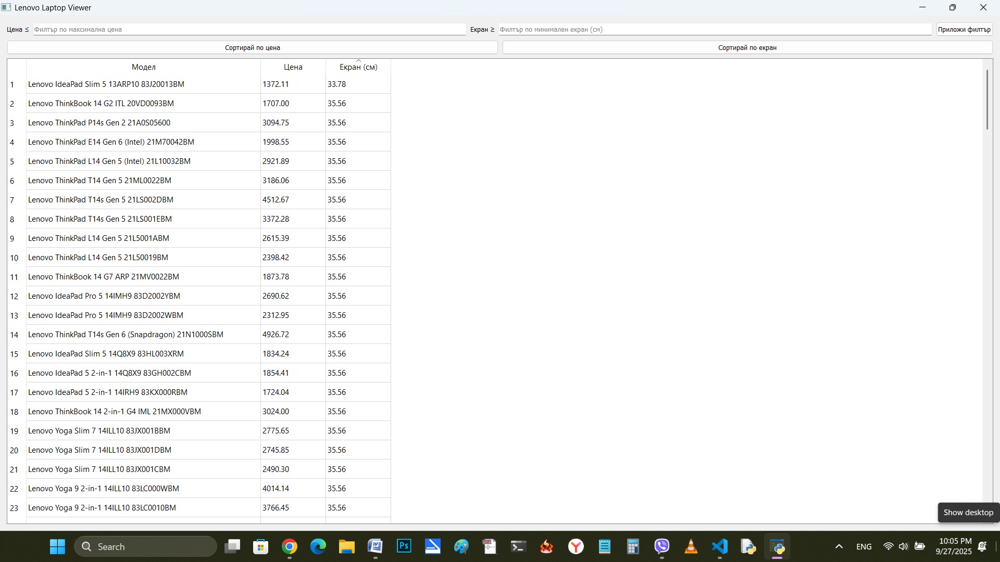
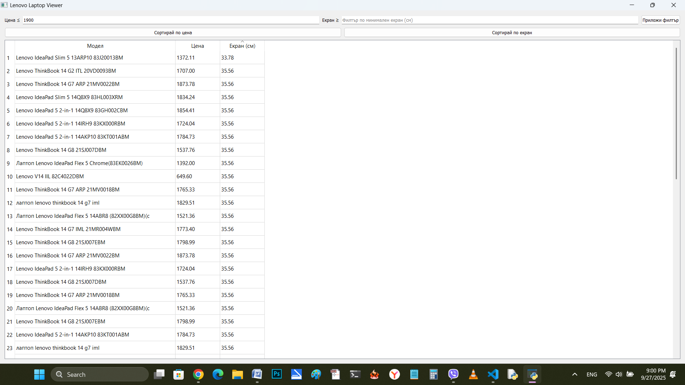
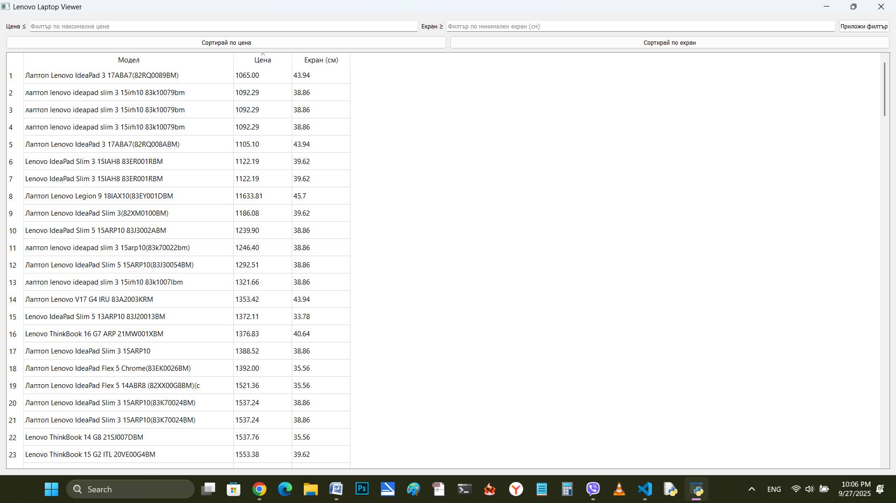

Lenovo Laptop Scraper Project

## A. Project Goal

The goal of this project is to extract information about Lenovo laptops — specifically the model, price, and screen size — from the website [https://www.jarcomputers.com](https://www.jarcomputers.com).  

## B. Project Structure
To achieve this, the project is organized into the following files:

- `scraper.py` – Web scraper for extracting the required data  
- `config.py` – Configuration file for connecting to the MySQL database  
- `gui.py` – Graphical user interface (GUI) using PyQt5  
- `laptop_data.sql` – SQL file for creating the database table  
- `main.py` – Main file that runs the entire application
- 'requirements.txt` – Dependencies list  

---

## C. Web Scraper (`scraper.py`)

### 1. `LaptopScraper` class

This class is initialized with a base URL and uses the following libraries:

- `requests` – to send HTTP requests to the webpage  
- `BeautifulSoup` (`lxml` parser) – to parse HTML content  
- `re` – used specifically for extracting screen size using regular expressions  
- `time` – adds a delay between requests (`time.sleep(2)`) to avoid overloading the server  

---

### ▸ `scrape_data()` method

This method loops through pages 1 to 4 containing Lenovo laptops. It extracts:

- **Model** – via the `alt` attribute of the product image  
- **Price** – via HTML parsing  
- **Screen size** – via a **regular expression** applied to the product description  

Since the HTML structure of the page may change over time, the use of regular expressions provides more flexibility for extracting screen sizes.

All extracted data is added to a list of dictionaries.

---

### ▸ `_parse_price()` method

A helper method that cleans up and formats the price string into a usable numeric format.

---

### ▸ `save_to_db()` method

Stores the extracted data in a MySQL database by:

- Creating a table (if it doesn’t already exist) with columns for model, price, and screen size  
- Deleting any previous records  
- Inserting the new data  
- Closing the database connection after execution

---

## D. Configuration (`config.py`)

This file contains a dictionary with the credentials needed to connect to the MySQL database:

- `host`, `user`, `password`, `database`

Keeping this in a separate file provides:

- Better security  
- Easier configuration and reuse  

> _Note: It is recommended to exclude this file from version control (e.g. via `.gitignore`) if sensitive data is used._

---

## E. Graphical Interface (`gui.py`)

This file uses:

- `PyQt5` – to create the graphical user interface  
- `mysql.connector` – to fetch and display data from the MySQL database  

A table view (`QTableView`) is created to show the extracted Lenovo laptop data.  
Users can **filter** the displayed results using two criteria:

- **Price**  
- **Screen size**

Filtering functionality is implemented using **text input fields (`QLineEdit`)** and/or **combo box selectors**.

---

## F. SQL File (`laptop_data.sql`)

This file contains the SQL script for creating the database table used to store the scraped data.  
The table includes columns for model, price, and screen size.

---

## G. Main Script (`main.py`)

This is the entry point of the application. It defines the main logic and shows the final result — a table displaying all Lenovo laptops with three columns: **model**, **price**, and **screen size**, along with filters in the table header.

In this file:

- The base URL for scraping is defined  
- An instance of `LaptopScraper` is created and used to scrape and save the data  
- GUI components are initialized and displayed  

External modules (`scraper.py` and `gui.py`) are imported, along with `sys`.

---

### ▸ `if __name__ == "__main__":` block

This block ensures that the code only runs **when the script is executed directly**, and not when it is imported as a module. This approach offers:

- **Control** – execution happens only when intended  
- **Flexibility** – classes like `LaptopScraper` and `CustomerViewer` can be reused elsewhere

**Inside the block:**

1. **Scraping the data:**
   ```python
   scraper = LaptopScraper(url)
   data = scraper.scrape_data()
   scraper.save_to_db(data)

---

## H. Technologies Used

| Module                 | Description                                 |
|------------------------|---------------------------------------------|
| `requests`             | For HTTP requests                           |
| `beautifulsoup4`       | For parsing HTML                            |
| `re` (standard)        | Regular expressions for screen size parsing |
| `mysql-connector-python` | MySQL database connection and queries    |
| `time` (standard)      | Sleep between requests                      |
| `config` (custom)      | Stores `db_config` connection dictionary    |

---

## I. How to Run

### 1. Clone the repository

git clone https://github.com/courseKA/FinalProject_JarcomputersLenovo.git
cd FinalProject_JarcomputersLenovo

### 2. Create and activate virtual environment

python -m venv venv
# On Linux/Mac
source venv/bin/activate
# On Windows
venv\Scripts\activate

### 3. Install dependencies

pip install -r requirements.txt

---

## I. Database (`config.py` + `laptop_data.sql`)
- Stores results in a **MySQL database**
- Automatically:
  - Creates table if not exists
  - Deletes old records
  - Inserts new laptop data

---

## J. Screenshots

### 1. Full GUI view


### 2. Filtering by Price or Screen Size


### 3. Sorted by price


---

## **K. Run the project**

python main.py
    
---

## **L. Requirements**

source venv/bin/activate  # On Windows use: venv\Scripts\activate
Install dependencies:
pip install -r requirements.txt

The requirements are in requirements.txt file.
